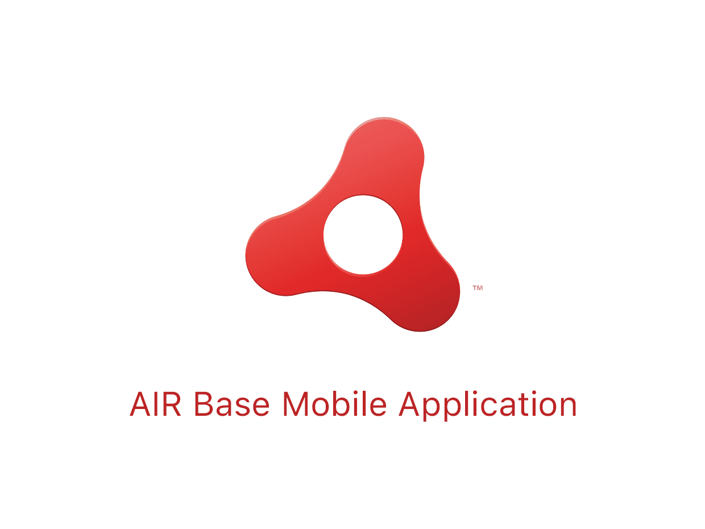
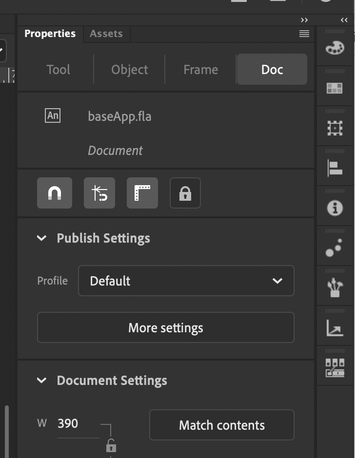
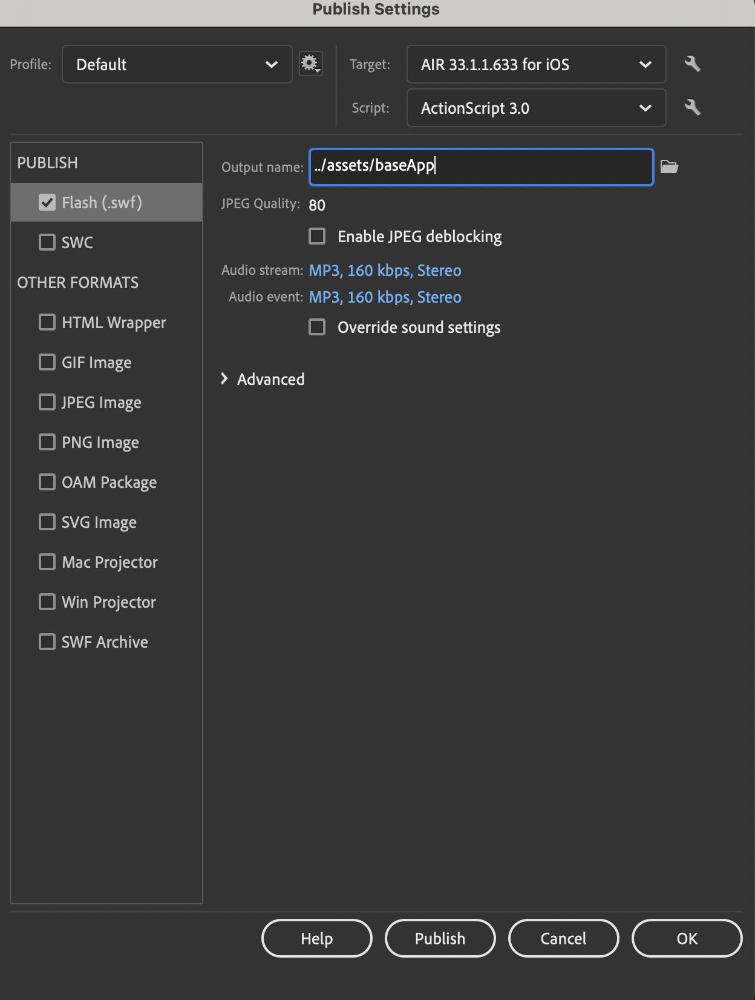
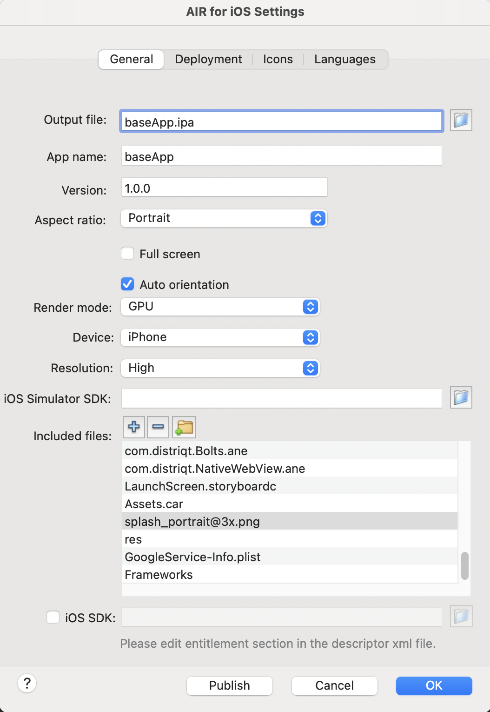
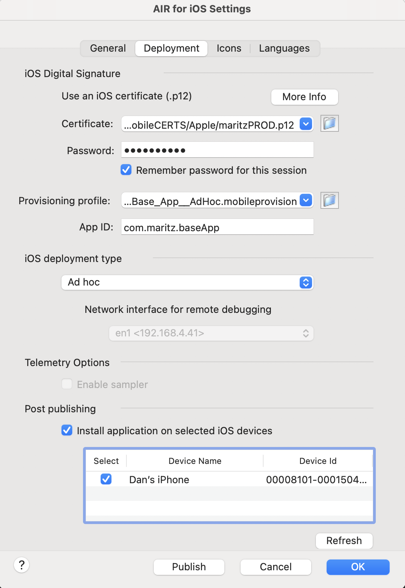

# AIR Base Mobile Application

The AIR Base Mobile application combines the power of [Adobe Animate CC](https://www.adobe.com/products/animate.html) to design custom UI that seemlessly integrates with [ActionScript 3.0](https://help.adobe.com/en_US/FlashPlatform/reference/actionscript/3/index.html) and is published using [Adobe AIR](https://airsdk.harman.com/download) for both Apple and Android devices. This application demos the [Distriqt AIR Native Extensions Library](https://airnativeextensions.com) using common mobile user flows.

### Sample User Flows
- Sign In / Create Account

### Animate CC Components
- Coming soon.

### ANE Features - AIR Native Extensions built by [distriqt //](https://airnativeextensions.com) 
- Firebase Auth
- Facebook Login
- Google Identity
- Apple Sign in

## Publishing for iOS

### Pre-Requisites
- [Apple Developer Memebership](https://developer.apple.com/programs/)
- Mac OSX
- Xcode (latest version)
- Adobe Air SDK (latest version)
- Connect iPhone to Mac usb port

### Step 1: Create a Publishing Certificate 
- https://calvium.com/how-to-make-a-p12-file/

### Step 2: Add Test Devices
- https://www.telerik.com/blogs/how-to-add-ios-devices-to-your-developer-profile

### Step 3: Create an App Identifier
- https://support.magplus.com/hc/en-us/articles/203808708-iOS-Creating-App-IDs

### Step 4: Create a Provisioning Profile
- https://support.magplus.com/hc/en-us/articles/204270188-iOS-Creating-an-Ad-Hoc-Distribution-Provisioning-Profile

### Step 5: Add Air SDK to Adobe Animate
https://helpx.adobe.com/animate/kb/get-started-with-latest-airsdk.html

### Step 6: Open baseApp.fla in Adobe Animate and open AIR SDK Settings menu (More Settings)

### Step 7: Change Target to latest AIR SDK and click on wrench icon

### Step 8: Verify general settings

### Step 9: Add .p12 cert and provisioning profile and verify deployment settings

### Step 10: Click publish to install on iPhone

## Publishing for Android 
- Coming soon.

## ANE Documentation

The [documentation site](https://docs.airnativeextensions.com/docs/) forms the best source of detailed documentation for the all ANE extensions used for this application.
